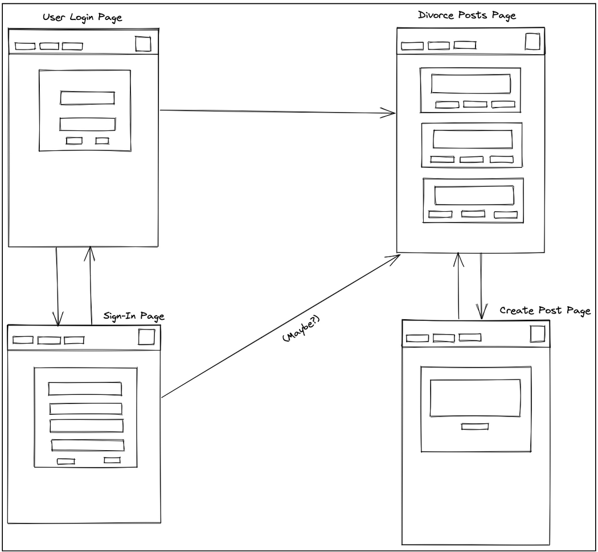
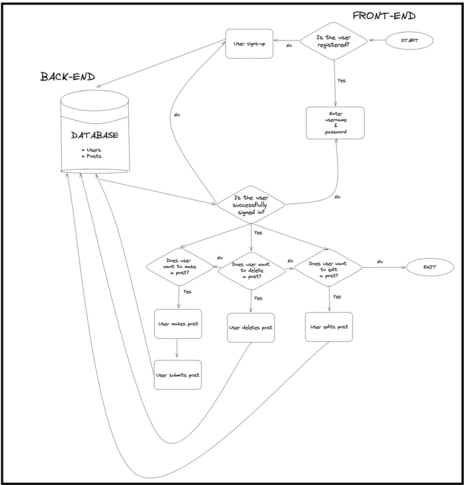

# Project 3 - MERN Guest Book

## Overview

1. [Description](#description)
2. [Deployment Link](#deployment-link)
3. [Installation](#installation)
4. [Technologies Used](#technologies)
5. [Deliverables](#deliverables)
6. [Planning/Build Process](#planning)
7. [Challenges](#challenges)
8. [Wins](#wins)
9. [Key Learnings & Takeaways](#takeaways)
10. [Future Improvements](#future-improvements)

## <a name="description"></a> 1. Description

A Full-Stack Guestbook application, built from scratch within 9 days by a team of 4 developers using the MERN stack (MongoDB, Express, React & Node). This group project was the third application built as part of the curriculum for the General Assembly Software Engineering Immersive Course.
<br>

The website allows users to sign up for an account and subsequently log into and out of their account. They also have the option to edit their username and password once they are logged in, or delete their account. Authentication was achieved by using the Node ExpressJS and Passport.js packages.<br>
Users can also read, post, edit and delete comments in the Guestbook application, the concept of which was tailored around a specific event type: a divorce party. The idea behind this concept was to support recent divorcees by enjoying their divorce party to the fullest and later re-live all the happy memories.


## <a name="deployment-link"></a> 2. Deployment link

- frontend deployment:
  https://mern-guestbook.katieloesch.co.uk/

- backend repository: https://github.com/katieloesch/p3-mern-guestbook-backend

- group repository:
  https://github.com/hpramanathan/project3-mernstack-app

## <a name="installation"></a> 3. Installation

- package manager used: npm (v9.6.7)
  - https://www.npmjs.com/package/npm
  - to install dependencies, run the following command in both the front end and back end directories:

```
npm install
```

## <a name="technologies"></a> 4. Technologies Used

### Front End

The front end of this application is based in ReactJS (v18.2.0), JavaScript, JSX and CSS.

- The front end was set up using the 'create-react-app' command
  - https://create-react-app.dev/

```zsh
create-react-app frontend
```

Additional packages:

- routing: react-router (v6.11.2)
  - https://www.npmjs.com/package/react-router
- authentication: bcryptjs (v2.4.3)
  - https://www.npmjs.com/package/bcryptjs
- UI
  - styling: TailwindCSS (v3.3.2)
    - https://tailwindcss.com/docs/guides/create-react-app
  - icons
    - iconify
      - https://iconify.design/
    - react-icons
      - https://www.npmjs.com/package/react-icons

### Back End

- the back end was set up using the following command:

```zsh
npm i express mongoose
```

Additional packages:

- express (v4.18.2)
  - https://www.npmjs.com/package/express
- CORS (v.2.8.5)
  - https://www.npmjs.com/package/cors
- dotenv (v.16.0.3)
  - https://www.npmjs.com/package/dotenv
- mongoDB (v5.4.0)
  - https://www.npmjs.com/package/mongodb
- mongoose(v7.1.0)
  - https://www.npmjs.com/package/mongoose
- nodemon(v2.0.22)
  - https://www.npmjs.com/package/nodemon
- authentication:
  - bcrypt (v5.1.9)
    - https://www.npmjs.com/package/bcrypt
  - jsonwebtoken (v.9.0.0)
    - https://www.npmjs.com/package/jsonwebtoken
  - passport (v0.6.0)
    - https://www.npmjs.com/package/passport
  - passport-jwt (v.4.0.1)
    - https://www.npmjs.com/package/passport-jwt

### Deployment

- MongoDB Atlas
  - used to deploy the MongoDB database
  - https://www.mongodb.com/cloud/atlas/register
- Heroku
  - used to deploy the back end
  - https://www.heroku.com/
- Netlify
  - used to deploy the front end
  - https://www.netlify.com/

### Additional tools used:

- Git / GitHub: version control
  - https://git-scm.com/
  - https://github.com/https://github.com/
- Postman
  - used to test the API endpoints
  - https://www.postman.com/
- Visual Studio Code (VSCode)
  - code editor used for writing CSS, JSX and JavaScript
  - https://code.visualstudio.com/
- Google Chrome browser
  - used for launching the website and displaying the application Google Chrome
  - Google Chrome Developer Tools: For troubleshooting and debugging
  - https://www.google.com/intl/en_uk/chrome/
- Excalidraw
  - used for building the wireframe + ERD
  - https://excalidraw.com/

## <a name="deliverables"></a> 5. Deliverables

### MVP Requirements

- thoroughly documented README.md file
- Excalidraw or Whimsical document to convey the data flow with component hierarchy included
- proper indentation, semantic variable names, adherence to naming conventions
- removal of:
  - unnecessary boilerplate React files and code
  - console.log()s
  - commented out code
- each team member should:
  - contribute equally
  - have a solid understanding of the entire project, even features implemented by other team members
  - pair program with teammates to reinforce learning
  - be prepared to explain sections of code that were written by teammates
- front end:
  - working, interactive React app, built using npx create-react-app client
  - at least 6 separate, rendered components in an organized and understandable React file structure
  - only React for DOM Manipulation
  - incorporation of data from an API, with the data being rendered in React components
  - inclusion of React Router for client-side routing
  - authentication
- back end:
  - working generic router actions for CRUD using Express, Mongoose and MongoDB
  - at least 2 models
    - full CRUD on at least one of the models
    - add/delete features on any remaining models
  - authentication
- styling:
  - CSS (flexbox or Grid)
  - responsive design on 2 screen sizes (including desktop) using a media query (mobile)
- deployment:
  - deployment of the fully functional front-end via GitHub Pages or Vercel
  - deployment of the back-end via Heroku or Vercel
  - deployment of the MongoDB database on MongoDB Atlas

### Stretch goals

- more than 2 models
- css framework e.g. TailwindCSS or Bootstrap

## <a name="planning"></a>6. Planning/Build Process

- The team working on this project included 4 members:

  - [Hari Ramanathan](https://github.com/hpramanathan) - GitHub Code Owner/Team Lead
  - [Benjamin Khoury](https://github.com/khouryb)
  - [Franziska Kissling](https://github.com/FrankieSlinn)
  - myself - [Katie Loesch](https://github.com/katieloesch)

- Timeframe:
  - The deliverables were issued to the team on: 04/05/2023.
    - A project proposal was to be submitted and approved by the instructional team before moving on to coding phase of the project.
    - The proposal was to include:
      - a description of the project
      - user stories
      - a database models flowchart
      - a schema
      - a wireframe
  - Project submission deadline + project presentation on: 12/05/2023

<br>

### Day 1: 04/05/2023

On day 1, the team brainstormed together to develop the project concept, design, coding approach and working schedule.
The team picked a team name (Chewing the CRUD) and agreed on a concept: A virtual guest book for an event, specifically, a divorce party. The team then discussed each member's strengths and weaknesses, the details of which were recorded in the [Team Expectations Setting Document](./assets/team_expectations_setting.pdf). <br>

Next, the team got started on the project proposal, working on the the wireframe, user stories, schema and flow chart containing the database models that had been agreed upon earlier in the day:

### wireframe



<br>

### User Stories

- As a user I should be able to access the website from different devices/browsers.
- As a user I should be able to register with a username and password.
- As a user I should be able to login with my username and password.
- As a user I should be able to view all posts.
- As a user I should be able to view my posts.
- As a user I should be able to write new posts.
- As a user I should be able to delete my posts.
- As a user I should be able to edit my posts.
- As a user I should be able to log off from the website.

<br>

### Schema


<br>

### Database Models Flowchart



<br>

After getting the proposal approved by the instructional team, a git repository was set up by team lead ([Hari Ramanathan](https://github.com/hpramanathan)) and shared with each member of the rest of the team ([Benjamin Khoury](https://github.com/khouryb), [Franziska Kissling](https://github.com/FrankieSlinn) and myself, [Katie Loesch](https://github.com/katieloesch)). Each team member then proceeded to create their own development branch on their local machine.

### Day 2: 05/05/2023

With the git repository and development branches set up, the team divided up the tasks and started the coding phase of the project:
I got started on the front end by setting the react application witht the 'npx create-react-app' command and installing react-router.
I then moved on to creating the 2 models for the project in the back end: a User and a Post model. These models have a one-to-many relationship where a User can have many posts but a post only belongs to one user.

```JavaScript
const mongoose = require('mongoose')
const Schema = mongoose.Schema;

const userSchema = new Schema({
    username: { type: String, required: true },
    password: { type: String, required: true },
    name: { type: String, required: true },
    posts: [{
        type: mongoose.Schema.Types.ObjectId,
        ref: "Post"
    }]

}, { timestamps: true })

const User = mongoose.model('User', userSchema)

module.exports = User;
```

```JavaScript
const mongoose = require('mongoose')
const Schema = mongoose.Schema;

const postSchema = new Schema({
    author: { type: String, required: true },
    title: String,
    content: { type: String, required: true }
}, { timestamps: true })

const Post = mongoose.model('Post', postSchema)

module.exports = Post;
```

With other members of the team focusing on the Post model and generating seed data for the database, I tackled the User model, writing code to implement full CRUD functionality:

- INDEX
- SHOW
- CREATE
- UPDATE
- DESTROY

I started by defining the different routes on the backend, below is the DELETE route for the User model as an example:

```JavaScript
router.delete('/users/:id', (req, res) => {
    User.findByIdAndRemove(req.params.id)
    .then(user => {
        if (user) {
            res.json(user)
        } else {
            res.status(404).json({
                error: {
                    name: 'DocumentNotFound',
                    message: "The provided ID doesn't match any documents"
                }
            })

        }

    })
    .catch((error) => {
        console.log(error)
        res.status(500).json({error: error})
    })
})


```

After testing all the backend routes in the Postman API platform and feeling condifent that they were working, I started implementing the frontend requests for User model.
Below is the the DELETE fetch request for the User model as an example:

```JavaScript
export const deleteOneUser = async (id) => {
    const fetchOptions = {
        method: "DELETE",
        headers: {
            "Content-Type": "application/json",
            "Accept": "application/json"
        }};

    const url = `http://localhost:5000/users/${id}`
    const response = await fetch(url, fetchOptions);

    if (!response.ok) {
        const errorMessage = await response.text();
        throw new Error(errorMessage);
    }

    return response.json();
}
```

### Day 3: 06/05/2023

Since the team had decided to use a CSS framework to do the styling, I installed tailwindCSS for the React front end. In order to learn this new-to-me framework, I created a sign up form to add new users to the database, making sure the form was responsive and would easy to navigate on mobile screens as well as larger screens.


### Day 4: 07/05/2023

On the fourth day I continued my tainwindCSS learning curve and created a responsive navigation bar for the website.


I also added a login page for users that are already in the databse:


### Day 5: 08/05/2023

On the fifth day of development the team focused on the deployment of the frontend to GitHub Pages and getting started on user authentication. I used the bcrypt package to make sure that passwords entered by users are hashed and salted before being stored in the database, making sure there are no plain-text passwords stored in the backend.

```JavaScript

router.post('/users', async (req, res) => {

    try {
        //Check if username already exists in db
        //If it does, send error
        const usernameExists = await User.find({username: req.body.username})

        if (usernameExists.length > 0) {
            res.send({error: "username already exists"})

        } else {
            //salt + hash password entered by user
            const salt = await bcrypt.genSalt()
            const hashedPassword = await bcrypt.hash(req.body.password, salt)

            const newUser = {
                username: req.body.username,
                password: hashedPassword,
                name: req.body.name,
                posts: []
            }

            //create new User document
            User.create(newUser).then(function(user) {
                res.status(201).json(user)
            })
        }
    } catch {
        res.status(500).json({error: 'Internal Server Error'})    }
})

```

### Day 6: 09/05/2023

I spent most of day 6 of development familiarizing myself with the passport and passport-jwt packages and writing the passport strategy. I also generated a random secret key and stored it in a .env file.

```JavaScript
require('dotenv').config()
const passportJWT = require('passport-jwt')
const ExtractJwt = passportJWT.ExtractJwt
const jwtOptions = {}
jwtOptions.jwtFromRequest = ExtractJwt.fromAuthHeaderAsBearerToken()
jwtOptions.secretOrKey = process.env.SECRET_KEY

```

```JavaScript

const Post = require('../models/post')
const User = require('../models/user')
const mongoose = require('mongoose');
const passportJWT = require('passport-jwt')
const JwtStrategy = passportJWT.Strategy

//when the client sends a request
    //check if client has valid JWT
    //check if token is expired
const strategy = new JwtStrategy(jwtOptions, async (jwtPayload, next) => {
    const data = await User.findOne({_id: jwtPayload.id})
    const user = {...data}
    if (data._id) {
        user._id = data._id.valueOf()
    }
    if (user._id && user._id === jwtPayload.id) {
        // If ID is in the db:
            // then user is legitimiate -> run the route requested by user
            // null: no errors
            // user: document retrieved from db that matched id of token
        next(null, user)
    } else {
        // If ID does not match any document in db -> skip requested route + return 401 status code
        // false: no user was retried from db
        next(null, false)
    }
})

```

After defining the strategy, I worked on the login route for the backend. When a request is made to the '/users/login' route, a callback function runs and does 2 main things:

1. check the login credentials (username and password)
2. if the credentials match a record in the database, retrieve the data stored about the user from the database and generate a new JWT token

When a user logs in through the login page on the front end, the username and password are stored in the body of a post request sent to the backend. The callback function first checks whether the username entered by the user exists in the database (usernames are required to be unique so if the username exists, only one document is returned). <br> If the username does not exist in the database an error message is returned. If it does exist in the database, the password entered by the user is compared to the password stored in the database using the bcrypt package as the password stored in the database is both hashed and salted. If the passwords match, a JWT token is generates and returned, along with the user data. If the passwords don't match, an error message is returned.

```JavaScript

router.post('/users/login', async (req, res) => {
    const user = await User.find({username: req.body.username})

    if (user.length == 0) {
        res.status(400).json({error: 'user does not exist in database'})
    } else {

        try {
            if (await bcrypt.compare(req.body.password, user[0].password)) {

                const payload = {
                    id: user[0]._id,
                    username: user[0].username
                }
                const token = jwt.sign(payload, jwtOptions.secretOrKey, {expiresIn: 432000})

                res.status(201).json({
                    success: true,
                    token: token,
                    user: user
                })

              } else {
                res.status(401).json({error: 'Invalid username or password'})
              }
        } catch(error) {
            res.status(500).json({error: error})
        }
    }
})
```

If there are no errors, the user data and token are returned to the client and the token is saved to localStorage in the browser:

```JavaScript
const findOnLogIn = async (loginData) => {
    const fetchOptions = {
        method: "POST",
        headers: {
            "Content-Type": "application/json",
            "Accept": "application/json"
        },
        body: JSON.stringify(loginData)
    };

    const url = 'http://localhost:5000/users/login'
    const response = await fetch(url, fetchOptions);
    return response.json();
}

const userData = await findOnLogIn(formData)
  if (userData.error) {
    alert("Invalid username or password, couldn't log in!")
  } else {
    localStorage.setItem("divorceJWT", JSON.stringify(userData.token))
  }

```

### Day 7: 10/05/2023

On day 7, the team worked on etablishing a connection with the Mongo Database and producing seed data to populate it. I also woked on a function to log the user out of their account. Upon logout, the JWT needs to be removed from localStorage.

```JavaScript
  function logUserOut() {
    localStorage.removeItem("divorceJWT")
    navigate('/users/logout')
  }
```

### Day 8: 11/05/2023

On day 8 I focused on integrating authentication to the routes I had created earlier. Whenever a user tries to access any route that is protected, the token in localstorage will be checked first to see if the user is authenticated. Below is the example of the route that takes a user to their account page, which they should not be able to access unless they have a valid token.

```JavaScript
router.get('/users/:id/account', passport.authenticate('jwt', {session: false}), (req, res) => {
    try {
        res.json({
            status: 200,
            message: 'login sucessful',
            user: req.user._doc
        })
    } catch(error) {
        res.json({error: error})
        console.log(error)
    }

})

```

```JavaScript
const getToAccountPage = async (id, token) => {
    let token = JSON.parse(localStorage.getItem('divorceJWT'))
    const url = `http://localhost:5000/users/${id}/account`
    const fetchOptions = {
        method: 'GET',
        headers: {
            'Content-Type': 'application/json',
            'Authorization': 'Bearer ' + token.token
    }}

    try {
        const response = await fetch(url, fetchOptions);
        const data = await response.json()
        return data
    } catch(error) {
        console.log(error)
    }
}

```

### Day 9: 12/05/2023 -> Submission deadline + Project Presentation

On the final day, finishing touches were added to the readme document and the team presented the project to their cohort.

## 7. <a name="challenges"></a> Challenges

- Authentication:
  - Developing user authentication posed challenges, in particular developing the passport strategy as none of the team members had worked with passport or passport-jwt before.
  - These challenges were overcome with extensive research and trial and error.
  - We also encountered issues retrieving user data after login due to the asynchronous nature of the fetch API, which we managed to resolve with some refactoring and the async/await syntax.
- Deployment:
  - A major challenge encountered at the end of the project was during front end deployment prep and its relation to the back end/Heroku server.
  - This connectivity issue caused a disruption in the expected flow of data and functionality, hindering the full operation of the website.
  - The team worked diligently to troubleshoot and resolve this bug, but was unable to do so, hence the website is only accessible via a _localhost_ as of the time of writing.

## 8. <a name="wins"></a> Wins

- The team managed to fullfill all the MVP requirements with the exception of front end deployment.
- TailwindCSS: every member on the team managed to learn and become proficient in a new CSS framework by the end the project.
- Authentication was successfully implemented after overcoming several challenges.

## <a name="takeaways"></a> 9. Key Learnings & Takeaways

- Good communication is key when working in a team that contributes to the same git repository.
- Reviewing git conflicts as a team can avoid issues of code getting deleted.
- Keeping the front end and back end code in separate git repositories avoids some complications during the deployment process.
- Frequently pulling changes from the main github repository and merging them to the local branch you're working on is helpful when trying to avoid merge conflicts with other team members' code further down the line.

## <a name="future-improvements"></a> 10. Future Improvements

- enable users to upload files so they can add profile pictures and add photographs to their posts
- incorporate a third-party api: displaying funny or motivational quotes specifically related to divorce would add interesting and relevant content to the website
